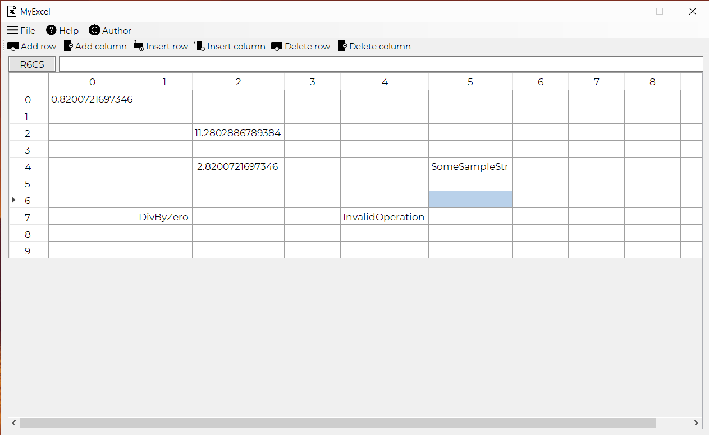
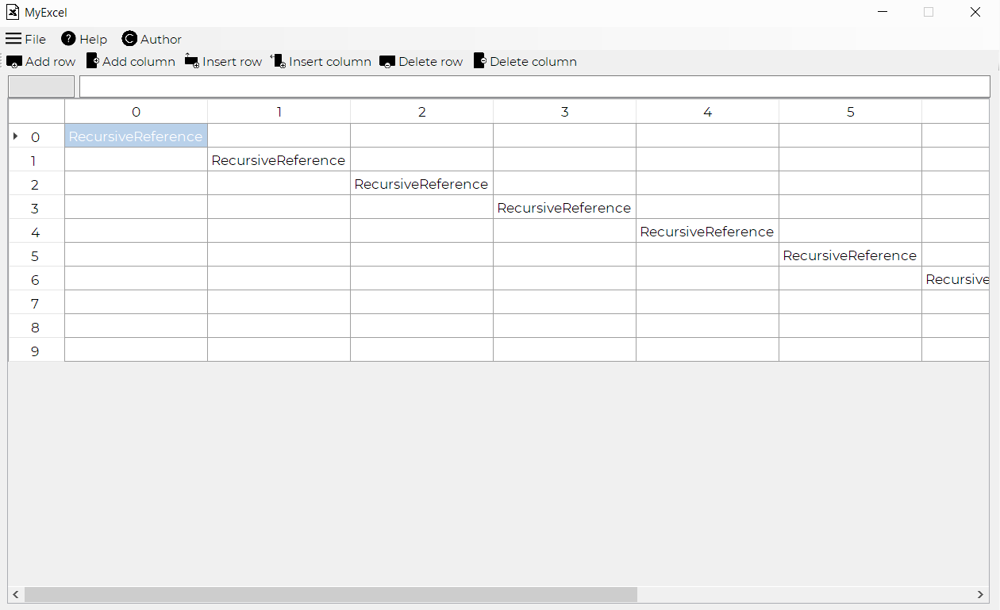
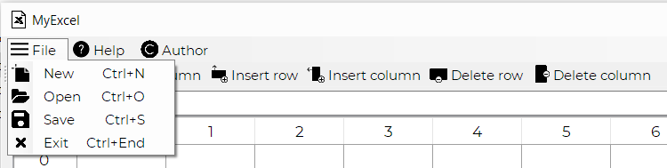

# MyExcel
# Implementation of analog of Microsoft Excel.  

I used WinForms for Front-End part of project, especially DataGridView tool. Also used open-source mathematical expressions parser/evaluator mXParser. You can read more about this great thing on http://mathparser.org/.

You can use all provided in mXParser math stuff, save files, open files and share them in XML format!

Screenshots:

